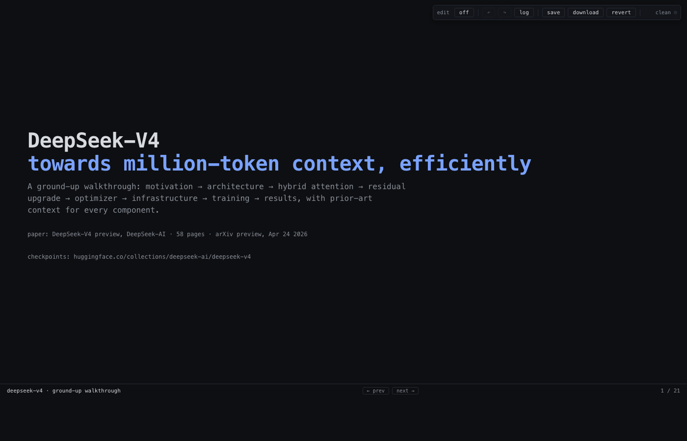

# live-html

> A single-file HTML page becomes its own WYSIWYG editor — and writes the edits back to the source file.



`live-html` is a tiny JS+CSS library (no build step, no framework, ~one file) that turns any hand-written HTML page into a content-editable surface, captures every keystroke into a coalesced op log in `localStorage`, gives you real undo/redo, and on **save** writes the modified DOM back to the original file via the File System Access API. Edits that touch CSS variables on the design-system slide bake into a single `<style id="theme-overrides">` block so themes stay diff-friendly.

It exists because every slide framework I've used — Slidev, Reveal.js, Marp, Spectacle, Quarto — splits source-edit and rendered-view. None round-trip.

## the gap it fills

Modern slide stacks all assume a one-way pipeline: you write Markdown / JSX / Pug / Quarto, a build step renders HTML, and you flip back to the editor to fix the typo you just spotted on the rendered page. Slidev has hot reload. Reveal has a speaker view. Marp has a VS Code preview. None of them let you click on the rendered word, retype it, and have your source file change. Notion-style editors round-trip but the artifact is a database row, not a git-friendly file. `live-html` is the smallest possible bridge: the rendered page **is** the source, and edits flow back to disk in place.

## install

Three drops into any single-file HTML page:

```html
<!-- in <head> -->
<link rel="stylesheet" href="editor.css">
```

```html
<!-- before </body> -- the toolbar -->
<div class="ebar" id="ebar">
  <span class="lbl">edit</span>
  <button id="eb-toggle">off</button>
  <span class="sep"></span>
  <button id="eb-undo">↶</button>
  <button id="eb-redo">↷</button>
  <button id="eb-history">log</button>
  <span class="sep"></span>
  <button id="eb-save">save</button>
  <button id="eb-download">download</button>
  <button id="eb-revert">revert</button>
  <span class="sep"></span>
  <span class="count" id="eb-count">clean</span>
  <span class="dot" id="eb-status"></span>
</div>
```

```html
<!-- last thing before </body> -->
<script src="editor.js"></script>
```

That's it. No bundler, no npm install, no config file.

## quickstart

1. Open your HTML page in Chrome or Edge.
2. Click **edit on** in the toolbar (top-right).
3. Click any element. Type. The status dot turns amber — you have unsaved ops.
4. ⌘Z / ⌘⇧Z work. The **log** button shows a coalesced timeline of every op, click-to-jump.
5. Click **save**. The browser asks for write permission to the file once. After that, save is one click.
6. On Safari/Firefox there is no FSA API, so save falls back to a download of the modified file. Drop it back in place.

## architecture in 60 seconds

Three layers, each isolated enough to understand on its own:

- **contenteditable layer.** Every editable region gets `contenteditable="true"` when edit mode is on. We hijack nothing about native text editing — selection, IME, paste, the usual.
- **op log.** Each input event is captured as a structured op (`{path, prev, next, ts}`), coalesced into the most recent op if it's the same node within ~600ms, and persisted to `localStorage` so a refresh doesn't lose work. Undo/redo walks this log; ⌘Z is wired to it, not to the browser's native undo stack.
- **save.** On save we replay the op log against the in-memory `documentElement.outerHTML`, ask the FSA API for a writable handle on the original file (cached after first grant), and write. CSS-variable ops are special-cased: they bake into a single `<style id="theme-overrides">` block instead of mutating inline styles, so the resulting diff is one block, not a thousand.

## design system

If your page contains a section with class `ds-slide` and child containers `#ds-colors` and `#ds-type`, `live-html` auto-renders a meta-editor: color swatches with native pickers, type-ramp rows with numeric inputs, a live components preview, and a raw-overrides block showing exactly what will be baked into `<style id="theme-overrides">` on save. Edits propagate to every instance of every class on the page in real time. This is the killer feature for slide decks: tweak `--accent` once, watch every pill and link and code block update across all 30 slides, save, commit a one-line diff.

## browser support

| Browser | Edit | Save |
| --- | --- | --- |
| Chrome / Edge / Arc | ✓ | native FSA write |
| Safari | ✓ | download fallback |
| Firefox | ✓ | download fallback |

Edits, the op log, undo/redo, and the design system work everywhere. Only the in-place save needs FSA.

## live demo

Try it on a page that **is** the editor: <https://gindachen.github.io/live-html/>

Toggle edit mode, retype the hero, drag the accent color, click save — your modified copy downloads.

## examples

A real-world deck built on `live-html`: the [deepseek-v4 ground-up walkthrough](../slides/deepseek-v4/slides.html) — 20 slides, design-system meta-slide, all hand-written HTML, all editable in place.

## claude skill

`live-html` ships with a Claude Code skill so an agent can author and edit your pages alongside you. The skill knows the toolbar markup, the op-log shape, and the `ds-slide` conventions, and will produce single-file HTML pages that drop in cleanly. Useful when you want to pair-program a deck or have an agent iterate on a design-system tweak while you watch the page update live.

## license

MIT.
